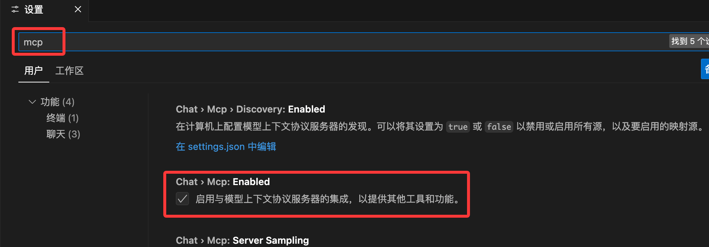

# auto-bug 

## 当前能力

- 支持 OpenAI（GPT 系列）和 DeepSeek 两类提供方，统一 HTTP 调用。
- bug_report: 基于上下文模版化生成bug报告
- debug_report: 基于上下文模版化生成debug报告

## TODO


## MCP 使用指南（实验性）

### 基本流程  
1. **准备配置**
   - 在仓库根目录配置 `config.toml`：写入 Obsidian Vault 路径（本地存储路径）、默认项目名、使用的 LLM 提供方以及对应 API Key名称。
   - API Key 放入 `.env`，程序会自动加载。

2. **运行命令**：
   ```bash
   # 安装依赖
   uv sync 
   
   # 激活虚拟环境
   ...

   # 启动MCP客户端
   auto-bug-mcp --host 127.0.0.1 --port 8001 --transport sse
   ```

3. **在客户端登记**  
- vscode
  1. 在设置中启用MCP

  2. 在当前项目中添加 .vscode/mcp.json 文件，为该工作区配置 MCP 服务器，如：
    ```
    {
      "servers": {
        "auto-bug": {
          "url": "http://127.0.0.1:8001/sse",
          "type": "sse"
        }
      },
      "inputs": []
    }
    ```
  3.  使用 # 工具名称 + 相关参数/指令补充 

- cursor
  1. 打开 Cursor Settings -> Tools & MCP -> New MCP Server, 配置
    ```
    {
    "mcpServers": {
      "auto-bug": {
        "url": "http://127.0.0.1:8001/sse"
      }
    }
  }
    ```  
  2. 在chat中使用agent模式， / + command， 可以create command

### 使用建议
- 提供完整的上下文信息，如日志、命令、行为路径...
- 当MCP调用参数解析错误时可主动指定参数，`bug_report`及`debug_report`可输入参数
  ```json
  {
    "project": "demo_project",
    "log_text": "Traceback (most recent call last): ...",
    "command": "python test.py --data orders_bad.json",
    "environment": "local-dev",
    "persist": true
  }
  ```
- 若 `persist=true`，服务会创建 `vault_root/project/bugNNN.md` 并把 Markdown 返回给客户端；`persist=false` 时仅返回内容，不写文件。


**CLI**
## 基本流程


2. 运行命令：
   ```bash
   cursor run tests > latest.log
   auto-bug ingest my_project latest.log
   ```
   或直接从标准输入读取：
   ```bash
   cursor run tests | auto-bug ingest my_project -
   ```
3. 工具会：
   - 解析日志（截取关键片段）。
   - 向 LLM 发送结构化请求，生成 Bug 报告 JSON。
   - 使用模板渲染 Markdown，并写入 `ObsidianVault/<project>/bugNNN.md`。

## 当前能力

- 支持 OpenAI（GPT 系列）和 DeepSeek 两类提供方，统一 HTTP 调用。
- 失败时提供最小错误提示，不会覆盖已有文件。
- 模板可按需自定义（参见 `templates/bug_report.md.j2`）。
